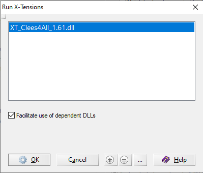
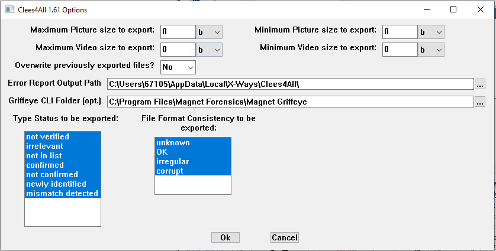
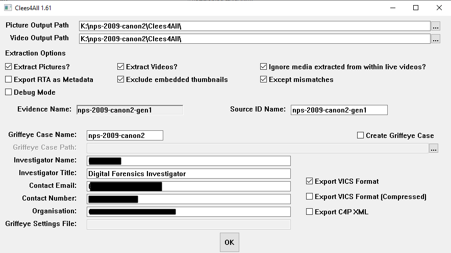

# Clees4All User Guide

This guide walks through preparing a case, running the Clees4All (C4All) X-Tension, and interpreting its output. It covers X-Tension version 1.61.

## Contents

- [Compatibility](#compatibility)
- [1. Preparing the case in RVS](#1-preparing-the-case-in-rvs)
- [2. Installing the file type signatures](#2-installing-the-file-type-signatures)
- [3. Loading the X-Tension](#3-loading-the-x-tension)
- [4. X-Tension options](#4-x-tension-options)
- [5. Running the X-Tension](#5-running-the-x-tension)
- [6. Post-run output and error reporting](#6-post-run-output-and-error-reporting)
- [7. Command line automation](#7-command-line-automation)

## Compatibility

| X-Ways Forensics version | Behaviour |
|---|---|
| Below 19.2 | Not supported — the X-Tension refuses to load |
| 19.2 – 19.2.x | Loads, but some features are disabled |
| 19.3 – 19.6.x | Loads, some features disabled |
| 19.5+ | Required for `XTParam:` command-line automation (see [§7](#7-command-line-automation)) |
| Below 20.3 | Device type detection is disabled |
| Below 20.5 | "Except mismatches" (thumbnail-mismatch exception) is unavailable and greyed out in the dialog |
| 20.5+ | All features available |

Windows 7 or later (64-bit) is required to run the compiled DLL.

## 1. Preparing the case in RVS

Clees4All is designed to run as its own RVS pass, **after** an initial RVS pass has already carved, hashed, and typed the evidence. Running initial processing first (without the X-Tension) makes it much easier to isolate any file that causes RVS to crash, since you can re-run just the X-Tension pass afterwards without repeating the expensive carving/hashing work.

A good baseline set of RVS options for the first pass:

- **File header signature search** — carves picture/movie/other files. Requires the C4All file type signatures (see [§2](#2-installing-the-file-type-signatures)).
- **Compute hash with MD5/SHA1** — set the primary hash to MD5 and secondary to SHA1. MD5 is mandatory; the X-Tension will refuse to run without it. Make sure the "Condition" box is left **unticked**, otherwise large files will be skipped and won't be hashed or exported.
- **Match hash values against hash database** — used with NSRL or a similar known-file database. It's recommended you have a "known good" hash set (categorised as irrelevant) to cut down the number of irrelevant images exported and reduce processing time.
- **Verify file types** — required so the X-Tension can tell pictures and videos apart from everything else.
- **Extract internal metadata** — not required for media export itself, but usually wanted as part of case processing.
- **Include contents of zip, rar, etc.** — required so media stored inside compressed files is extracted.
- **Extract email messages and attachments** — required so media stored inside email archives is located and extracted.
- **Uncover embedded data in various file types** — required to extract `Thumbs.db` contents and media stored as BLOBs in SQLite databases, etc.
- **Omit irrelevant files (hash database)** / **omit excluded files** — speeds up processing and lets files that would otherwise crash RVS be skipped.
- **Picture analysis and processing** — set to compute PhotoDNA hashes.

Additional options (encryption tests, document identification, etc.) can be enabled without affecting the X-Tension.

When prompted, select the hash databases to match against, then the File Header Search window will appear — see [§2](#2-installing-the-file-type-signatures) if the `C4All Pictures Version 1.1` signature set isn't listed. Note that any live file X-Ways considers a Picture or Video will be exported by the X-Tension; the signature sets are for carving additional (deleted/unallocated) instances. Add extra file types to the signature sets if a specific case needs them.

## 2. Installing the file type signatures

The X-Tension relies on a companion file type signature set — **not** anything from a third party — to drive the RVS carving step, containing the `C4All Pictures`, `C4All Videos`, and `C4All Compound` groups. It's distributed alongside the compiled X-Tension in the project's [releases](../../../releases) rather than kept in this repository.

Import it once via X-Ways' File Header Signature Search editor. If you don't see `C4All Pictures Version 1.1` (or later) listed when configuring the file header signature search, download it from the release and import it before continuing.

## 3. Loading the X-Tension

Add the X-Tension to X-Ways from the "Run X-Tensions" dialog (tick **Run X-Tensions** in the RVS options, then use the **+** button to browse to `XT_Clees4All_<version>.dll`):



The X-Tension supports multi-threading and has been tested with RVS running up to 8 threads.

Clicking the **…** button next to the X-Tension in this dialog opens the X-Tension's own options page (see [§4](#4-x-tension-options)).

## 4. X-Tension options

This dialog holds settings that apply across runs and are independent of any single case:



- **Maximum / Minimum Picture size to export** and **Maximum / Minimum Video size to export** — size filters, set independently for pictures and videos. `0` in a maximum field means no upper limit. Units are selectable per field (a "Kb" here is 1024 bytes, and larger units follow the same 1024-based scale, not 1000-based).
- **Overwrite previously exported files?** — if a previous run was interrupted partway through, leaving this at the default **No** avoids re-exporting files that were already written.
- **Error Report Output Path** — where debug information is written. Defaults to a `Clees4All` folder under the X-Ways local AppData folder, with a subfolder per case (named after the case title, e.g. `123-17`).
- **Griffeye CLI Folder (opt.)** — the folder containing Griffeye Analyze's command-line executable. Only required if automatic Griffeye case creation will be used (see [§5](#5-running-the-x-tension)); this requires a Griffeye Analyze edition/version that supports command-line case creation (DI-Pro, version 18+).
- **Type Status to be exported** — a multi-select list of X-Ways type-verification statuses (not verified, irrelevant, not in list, confirmed, not confirmed, newly identified, mismatch detected). Ctrl+click to deselect statuses you don't want exported; all are selected by default.
- **File Format Consistency to be exported** — a multi-select list of X-Ways file format consistency statuses (unknown, OK, irregular, corrupt), selected the same way.

## 5. Running the X-Tension

Once RVS starts with the X-Tension enabled, the main extraction dialog is displayed on the first volume processed:



*(Investigator Name, Contact Email, Contact Number, and Organisation are redacted in this example — those fields hold your own submitter details, not fixed values.)*

**Output paths**

- **Picture Output Path** / **Video Output Path** — where extracted files and their XML/VICS output will be written. These can point at the same folder; if the compressed VICS format is also selected, all output ends up in a single zip file when the two paths match.

**Extraction options**

- **Extract Pictures?** / **Extract Videos?** — at least one must be ticked; both may be ticked together. Unticking one means that media type isn't exported.
- **Ignore media extracted from within live videos?** — skips media carved out of a file that has already been exported as a live video, avoiding duplicate export of the same content.
- **Export RTA as Metadata** — exports user-created report table associations (not X-Ways' built-in system tables) into a `XWF Report Table` metadata field in the JSON output; review tools such as Griffeye may surface this field.
- **Exclude embedded thumbnails** — excludes files named `Thumbnail.jpg` embedded within valid picture files.
- **Except mismatches** — works with the option above: only thumbnails associated with the "Thumbnail Discrepancy" or "Thumbnail notable (data corrupt/incomplete)" report tables are still included. Requires X-Ways 20.5+; greyed out otherwise.
- **Debug Mode** — verbose logging for diagnosing crashes/errors. Leave off for normal use.

Settings are remembered between runs, so these generally only need setting once unless a case needs different options.

**Evidence objects**

Below the extraction options is a list of evidence objects the X-Tension will run against — one row per top-level evidence object (e.g. `AB/1`, not each partition within it). The left-hand value is the name from the X-Ways case; the right-hand value is what gets written as the VICS `SourceID` and used to name the C4P/C4M XML files. Two evidence objects can share the same right-hand name (e.g. to merge two disks from one exhibit into a single VICS source), but doing so means files can no longer be attributed to a specific one of the two objects from the export alone.

**Griffeye case creation**

- **Griffeye Case Name** and **Griffeye Case Path** — required if the X-Tension should automatically create a Griffeye case once processing finishes. Untick **Create Griffeye Case** to skip this. Requires the Griffeye CLI folder to be set in the X-Tension options ([§4](#4-x-tension-options)) and a Griffeye Analyze edition that supports command-line case creation.
- **Griffeye Settings File** — an optional Griffeye import-settings profile name (e.g. `customsettings.json`) to apply to the created case. Expected to live in Griffeye's default config folder, `C:\ProgramData\Griffeye Technologies\Griffeye Analyze\Data\Config\`, unless installed elsewhere.
- **Investigator Name**, **Investigator Title**, **Contact Email**, **Contact Number**, **Organisation** — case submitter details written into the VICS output for use by the receiving tool. Investigator Name is pre-filled from the X-Ways case's investigator details; the rest only need entering once as they're remembered between runs.

**Export format**

- **Export VICS Format** and **Export C4P XML** — choose one or both output formats; both are produced by default.
- **Export VICS Format (Compressed)** — packages the VICS output into zip file(s) alongside the source files: one combined zip if the picture and video output paths match, otherwise one zip per type. Not currently supported together with **Create Griffeye Case**.

While the X-Tension runs, watch the msglog window for errors — they often point at specific problem files. See [§6](#6-post-run-output-and-error-reporting) for what happens after the run finishes.

## 6. Post-run output and error reporting

After the run, the X-Tension reports the number of files excluded, broken down by reason. From X-Ways 19.4 onwards this summary is also stamped into the case log so it can be reviewed later. If a case produces a large number of errors, re-run in Debug Mode ([§5](#5-running-the-x-tension)) for more detail.

Every excluded or errored file is also linked to a corresponding report table, so affected items can be located and reviewed directly in X-Ways:

| Display message | Report table | Reason |
|---|---|---|
| Unknown Item Type | XT_CLEES4ALL Item Type Error | X-Tension couldn't determine the item's type |
| Unknown File Size | XT_CLEES4ALL Unknown File Size | X-Tension couldn't determine the item's file size |
| No Hash Computed | XT_CLEES4ALL No Hash Computed | X-Tension couldn't obtain a hash value for the file |
| File Write Size Mismatch | XT_CLEES4ALL File Write Size Mismatch | The size actually written didn't match the size X-Ways reported |
| Unable to Open File | XT_CLEES4ALL Unable to open File | X-Tension couldn't open the file to read its contents |
| Excluded on parent | XT_CLEES4ALL Excluded on parent | Excluded because it was embedded in an already-exported live video file |
| Excluded as duplicate | XT_CLEES4ALL Excluded as Duplicate | Same first sector and hash as another already-exported file; the X-Tension keeps the most relevant copy (live over deleted, deleted over carved) |
| Excluded on File Size | XT_CLEES4ALL Excluded Based on File Size | Outside the configured min/max size for its type |
| Excluded Thumbnail | XT_CLEES4ALL Excluded Thumbnail Embedded in Image | Excluded by the "Exclude embedded thumbnails" option |
| Excluded File Type Status | XT_CLEES4ALL Excluded File Type Status | Item's type status wasn't one of the statuses selected in the X-Tension options |
| Excluded File Format Consistency | XT_CLEES4ALL Excluded File Format Consistency | Item's file format consistency wasn't one of the statuses selected in the X-Tension options |

## 7. Command line automation

X-Ways 19.5+ supports passing command-line arguments through to X-Tensions, prefixed `XTParam:`. Clees4All recognises the following parameters, each supplied as `XTParam:<key>:<value>`:

| Parameter | Value | Effect |
|---|---|---|
| `picpth` | output folder | Picture output location. Omit to skip picture export. |
| `vidpth` | output folder, or `*` | Video output location. `*` reuses the `picpth` value. Omit to skip video export. |
| `grfpth` | folder | Output location for an automatically created Griffeye case. Requires a Griffeye Analyze edition supporting command-line case creation, and the Griffeye CLI folder set in the X-Tension options ([§4](#4-x-tension-options)). |
| `grfcse` | name | Name for the automatically created Griffeye case. |
| `grfset` | filename | Griffeye import-settings profile to apply, e.g. `customsettings.json`. Expected in `C:\ProgramData\Griffeye Technologies\Griffeye Analyze\Data\Config\` by default; give the filename only, not the full path. |
| `exthmbs` | (flag, no value) | Equivalent to ticking "Exclude embedded thumbnails". |
| `exthmbex` | (flag, no value) | Equivalent to ticking both "Exclude embedded thumbnails" and "Except mismatches". |
| `compressVICS` | (flag, no value) | Switches output to compressed VICS export only (equivalent to "Export VICS Format (Compressed)"), disabling plain VICS and C4All XML export. |

Omitting a parameter is equivalent to leaving the corresponding option unticked in the GUI — e.g. omitting `vidpth` means no video export.

Example:

```
xwforensics64.exe "C:\Users\user\test.xfc" "XTParam:picpth:D:\test\output" "XTParam:vidpth:*" "XTParam:grfpth:K:\Test\Griffeye" "XTParam:grfcse:test" "Override:1" RVS:~ auto
```
